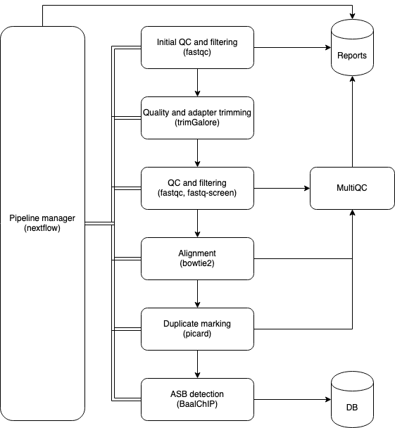

This project contains a pipeline for calculating allele-specific binding affinity from a pre-downloaded set of fastq files using BaalChIP.

# Requirements
- If using anaconda, you will need to have bioconda in your channel configuration
```
conda config --add channels defaults
conda config --add channels bioconda
```

# Design

Baal-NF is a pipeline for computing allele-specific binding variants (ASBVs) in cancer and non-cancer cell lines.
It features quality checking and reporting using fastqc, fastq-screen and multiqc, and uses the [BaalChIP](https://github.com/InesdeSantiago/BaalChIP) R package for the detection of ASBVs.
The pipeline is run using nextflow, and currently supports native and anaconda environments only.



# Usage and Configuration

The hg19 index for bowtie2 is automatically downloaded from the AWS iGenomes s3 bucket. Should you wish to download it manually, set the bowtie2_index parameter in your pipeline configuration or on the command line to point to the folder containing the required index files, i.e.

```groovy
params.bowtie2_index = "/path/to/bowtie2/index"
params.genome = "index_file_basename" // e.g. hg19
```
**Warning**: Note that BaalChIP uses blacklists based on hg19, and currently no other reference genomes are supported. You must use hg19 for all input files to this pipeline.

## Configuration profiles

The pipeline currently supports docker, singularity and anaconda for dependency management. We recommend using docker or singularity for reproducibility, though anaconda may be used if your computing infrastructure does not support containers. 

If using anaconda, you will need to manually create an anaconda environment and install our modified version of BaalChIP manually from (https://git.ecdf.ed.ac.uk/oalmelid/BaalChIP). The path to this environment should then be provided as the parameter `baal_chip_env` (see below).

The following configuration profiles are available for general use
| Name | Description |
| :----- | :----- |
| docker | Use the docker container engine |
| singularity | Use the singularity container engine |
| conda | Use anaconda environments |
| test | Run the pipeline test set, can be used in combination with any of the above environment profiles |

## Input file format

baal-nf requires a listing of input files in CSV format, with the following named columns

| Column name | Example | Description |
| :----- | :----- | :----- |
| cell_line | GM12878 | Cell line |
| transcription_factor | ESR1 | Transcription Factor |
| run | SRR123456 | Unique identifier of sequencing run |
| fastq_1 | `/scratch/mydata/experiment/GM12878_ESR1_1.fastq.gz` | FASTQ file 1, use this field if using single-end sequencing |
| fastq_2 | `/scratch/mydata/experiment/GM12878_ESR1_2.fastq.gz` | FASTQ file 2, leave blank if using single-end sequencing |
| bed_file | `/scratch/mydata/bedfiles/GM12878_ESR1.bed` | Path to bed file containing peak calls for the sequencing run |
| snp_list | `/scratch/het_snps/GM12878_hetSNP.txt` | TSV file containing het SNPs and RAF in the [format expected by BaalChIP](https://github.com/InesdeSantiago/BaalChIP/blob/master/inst/test/GM12891_hetSNP.txt) |

All files may be either local paths, HTTP URLs or S3 uris. Nextflow will automatically stage any files not present in the local filesystem.

Other columns may be included in the input file for bookkeeping purposes. `baal-nf` will ignore these fields in its output.

## Configuration options

Some configuration can be set using nextflow's usual custom parameters, either on the command line using double-dashed command line options, or in a nextflow configuration file in the `params` scope. The full list of configuration options is as follows

| Parameter | Default | Description | Required? | 
| :----- | :----- | :----- | :-- |
| sample_file | No default| Path to input file as specified [in the previous section](##input-file-format) | Yes 
| fastq_screen_cache | `"${launchDir}/assets/fastq_screen"` | Path to folder containing fastq screen reference genomes, as generated by running the command fastq_screen --get_genomes. The folder must contain a folder named `FastQ_Screen_Genomes`, which again must contain a copy of `fastq_screen.conf`. The pipeline will automatically download these genomes if not specified. | No
| bowtie2_index | `"s3://ngi-igenomes/igenomes/Homo_sapiens/UCSC/hg19/Sequence/Bowtie2Index/"` | Location of bowtie2 index files if using local cache | No
| genome | `"genome"`| Name of the reference genome used for mapping. This should correspond to the file name for your local copy of hg19, if changed. | No 
| fastqc_conf_pre | `"${workflow.projectDir}/data/before_limits.txt"` | `fastqc` configuration used for pre-screening| No
| fastqc_conf_post | `"${workflow.projectDir}/data/after_limits.txt"`| `fastqc` configuration used after adapter trimming | No
| report_dir | `"${workflow.launchDir}/reports/"`| Directory to place all reports in, defaults to a subfolder named `reports` in the launch directory. | No
| run_gat | `true` | Whether to run GAT enrichment analysis against the ENSEMBL genome annotations | No
| baal_chip_env | null | Only required when using the conda profile. Path to conda environment containing BaalChIP | Yes, if using the conda profile

# ToDo

- Automatic export to SQL or SQLite database
- Configurable genomes
