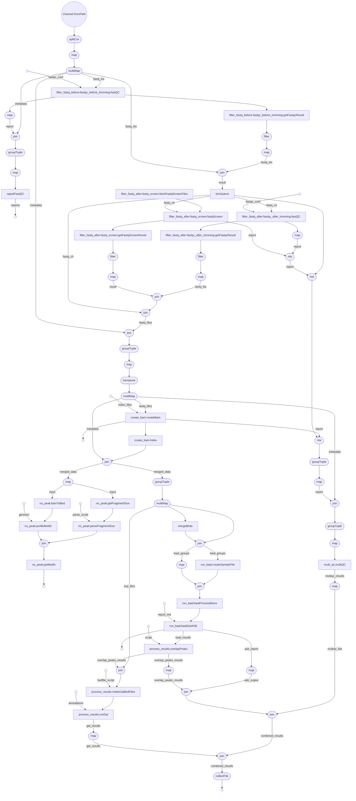

# Pipeline Design

# Background and Motivation

# Design Decisions
- Coarse-grained QC
- How to handle replicates

# How to add features to the pipeline

# Future Work

- Migrate BaalChIP to MCMC for whole monte carlo run
- Fix BaalChIP unit tests
- Motif calling and filtering
- Refactor pipeline to reduce number of parameters being passed around

# Stages

The pipeline consists of a number of stages. See the flowchart at the end of this document for a brief overview.

## QC

### Initial FastQC

Processes:
- `qc::fastQC`
- `qc::getFastqcResult`

This stage is a coarse filter, intended to throw out input that for whatever reason is unparseable or of so low quality that it's not fit for further processing. Most FastQC filters are disabled. The ones that are used are

- `quality_sequence`
- `tile`
- `sequence_length`

Full configuration can be found in [data/before_limits.txt](/data/before_limits.txt).

`getFastqcResult` is a simple bash script that will print FAIL to stdout if one or more filters have failed.
The `filter_fastq` workflow uses this to discard any fastq files that do not meet the threshold.

### TrimGalore

Process: `fastq::trimGalore`.

This runs `TrimGalore` on the fastq files, to perform best-guess adapter trimming.
No optional arguments are passed, but `TrimGalore` is called appropriately for single-stranded and double-stranded fastq files.

Trim galore produces a report, which is collated alongside other reports and provided to multiQC later.

### Fetching FastqScreen files

Process: `qc::fetchFastqScreenFiles`

This process stores the reference genomes required by `FastqScreen` in a configurable folder as designated by `fastq_screen_cache`.
This step is only run once per user.
If the folder already exists, this process will not run.

### FastQ-screen

Process: `qc::fastqScreen`

`FastqScreen` looks for sample contamination by randomly sampling reads and seeing if they match reference genomes from a wide variety of species.
It produces a report which is collated by MultiQC.

### Filtering based on FastqScreen results

Process: `qc::getFastqScreenResult`

This is a simple python script that looks through all non-human reference genomes in the FastQ-screen report.
If, for any genome, less than a configurable percentage (`max_acceptable_unmapped`) of the input reads are not mapped (i.e. if a large amount of the input reads are successfully mapped to this genome), the input file is discarded as likely contaminated. 

### FastQC

`FastQC` and filtering is done exactly as for [the initial fastqc filtering](#initial-fastqc), but with a different configuration file, namely [data/after_limits.txt](/data/after_limits.txt)

These are the same processes, the workflow is imported twice into [`main.nf`](/main.nf) as `filter_fastq_before` and `filter_fastq_after`.

## Mapping

### Bowtie2

Process: `fastq::createBam`
Maps using the `hg19` reference genome from igenomes by default.
Note that if you change the reference genome you will also need to modify the use of BaalChIP to use different blacklists when doing variant calling.

### picard

Process: `fastq::markDuplicates`
Marks duplicate reads.

## BaalChIP

### Create Config File

Process:`baal::createSampleFile`

Creates a configuration file for use by BaalChIP (see e.g [the example files included with BaalChiP](https://github.com/InesdeSantiago/BaalChIP/blob/master/inst/test/exampleChIP.tsv)).

### Filter Reads and Count Instance of Each Allele

Process: `baal::baalProcessBams`

The first of two stages using the BaalChIP package. The following is done in this step

- Discards all reads below a certain read quality threshold
- Filters out reads overlapping blacklisted areas
- Filters out duplicate reads
- Constructs a table of heterozygous SNPs, with counts of how many reads have been observed for each allele
- Filters out any SNPs for which only one of the two alleles have been observed

### Get Allele-specific Binding Sites

Process: `baal::getAsb`

Runs a markov-chain monte carlo simulation based on the results from the previous step, along with input allelic ratios.
This outputs the final allele-specific binding results.

Also produces a BaalChIP report, in the form of a rendered PDF.

## Post-processing

### multiQC

Collate all QC reports except for the initial run of FastQC into a single report. Inputs from
- FastQC
- Picard
- Bowtie2
- FastQ-Screen

### GAT

Genome Analysis Toolkit. This runs enrichment analysis, comparing called ASB sites to all heterozygous SNPs in a given cell line, and looking for enrichments in e.g. enhancers, promoters, promoter-flanking regions, etc.

## Motif Calling

# Output Files and Structure

# Debugging tips and tricks

# Flowchart

