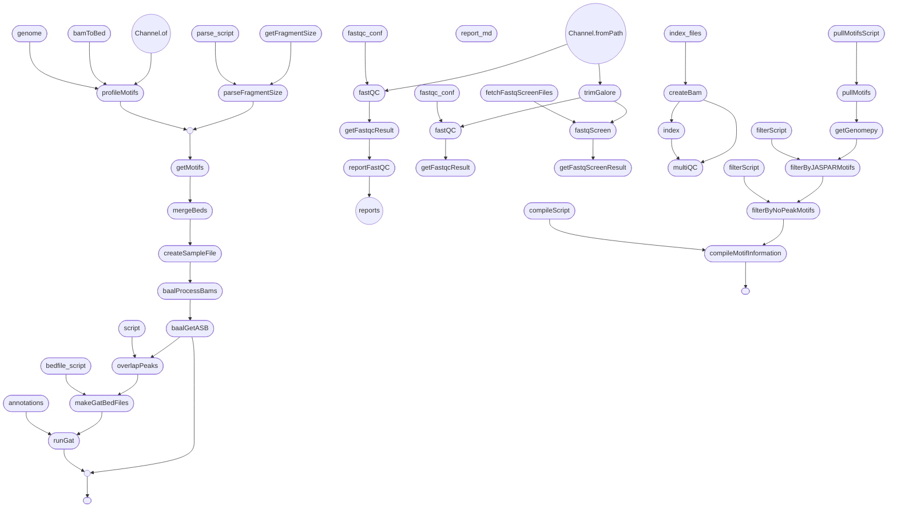

# Pipeline Design

This document is intended to detail all processes in the pipeline, what their intended purpose is, any design decisions that have been made, and possible future modifications.

Notes on data curation will be provided in a separate document in the relevant pipeline run repository.

# Design Decisions

The pipeline was built to process a large amount of data, with limited knowledge about data quality, provenance, and negative controls.
As such, the design focuses on processing large amounts of data with coarse-grained but restrictive QC filters.
Several modifications have also been made to the BaalChIP package to accomodate bulk processing of data.

We have aligned as much as possible in package choices with the [nf-core chipseq pipeline](https://github.com/nf-core/chipseq), though crucially some of their read filtering has not been implemented, and might be desirable.

## Relevant Packages

Most of the packages used in this pipeline are common to most NGS pipelines.
We do, however, use a few less well-known packages, as detailed below.

- [BaalChIP](https://github.com/InesdeSantiago/BaalChIP) - [Paper](https://genomebiology.biomedcentral.com/articles/10.1186/s13059-017-1165-7)
- [NoPeak](https://github.com/menzel/nopeak) - [Paper](https://pubmed.ncbi.nlm.nih.gov/32991679/)
- [GAT](https://github.com/AndreasHeger/gat) - [Paper](https://pubmed.ncbi.nlm.nih.gov/23782611/)
- [GimmeMotifs](https://github.com/vanheeringen-lab/gimmemotifs) - [Paper](https://www.ncbi.nlm.nih.gov/pmc/articles/PMC3018809/)

## Coarse-grained QC

We use FastQC and FastQ-screen to perform go/no-go filtering.
Automated adapter trimming is done with TrimGalore with default arguments.
Which files are kept or filtered out can most easily be deduced by looking at the MultiQC report for a given transcription factor and cell line.

These filters are intended to be lenient and coarse-grained, to remove e.g. contaminated or very low read-quality samples that might pollute the results.
We performed some initial testing with stricter QC requirements and found no appreciable difference in pipeline output.

Some fine-tuning based on what data is included might be desirable for individual experiments.
In the future it might be desirable to e.g. add a flag to disable QC, and do manual QC on a per-experiment basis before running the pipeline.

See the sections below on FastQC and Fastq-screen for details on the filtering criteria.

## Changes to BaalChIP

### Replicate handling

BaalChIP originally filtered out any SNPs where, for each replicate, all reads covered only one of the two alleles.
For our purposes this was found to be overly restrictive, since a single low-read-count file could thereby disable ASB detection for all input files for a given TF/Cell Line combination.

We modified BaalChIP to pool reads from all replicates before filtering on allele counts.
This has the advantage of being easy to implement, though a more fine-grained filtering where e.g. we require overlapping reads in each technical replicate for a given experiment, but pool across experiments would likely help with filtering out noise.

### Peak filtering

We introduced an option in alleleCounts (`all_hets=False`) to not filter out SNPs that fall outside ChIP-seq peaks. 
In stead, the output file from baal-nf contains an additional boolean column (`peak`), indicating whether the given SNP was found to be within a peak or not. See the section on `overlapPeaks` below.

### Performance optimisation

Previously, BaalChIP parallelised the markov chain monte carlo simulation across SNPs, but returned the whole random walk to the main thread before computing summary statistics.
We have altered this behaviour by computing the summary statistics within each thread, thereby reducing memory and communications overhead significantly.
We have observed this leading to a ten-fold reduction in memory footprint and a two-fold increase in speed in some datasets.

### Flexible clustering methods

We have introduced a `clusterType` argument to `getASB`, allowing the end user to choose what type of cluster to utilise in an agnostic manner. It defaults to `PSOCK`.
Available cluster types are any that work with `parallel::makeCluster`, i.e. `PSOCK`, `FORK`, and any other type that can be passed to `snow`.
See [the R parallel docs](https://www.rdocumentation.org/packages/parallel/versions/3.6.2/topics/makeCluster) for further details.

### Cluster worker log

We add the argument `workerLog` to `getAsb`.
This defaults to `nullfile`, but can be changed to write logs from each cluster worker to a file for debugging.
This can be particularly useful if the pipeline fails silently in the `getASB` stage.

### Multiple credible intervals

We have modified BaalChIP to support outputting multiple credible intervals in the following way.

If `conf_level` is a single number, BaalChIP behaves as before.
If `conf_level` is a vector, BaalChIP treats the first element of the vector as the basis for its usual output, including for ASB calling.
This first confidence level forms the basis for the output columns `Bayes_lower` and `Bayes_upper`.
Any additional confidence levels are output as `conf_{level}_lower`/`conf_{level}_upper`, where level is the requisite confidence level as a float (e.g. `conf_0.99_upper` for a 99% credible interval).

### Output standard deviations from MCMC

We introduce an additional output column, `Bayes_SD`, which contains the standard deviation as observed based on the MCMC random walk.

### Bugfix: handle cases where only one technical replicate exists

BaalChIP had some faulty handling of cases where only one technical replicate existed for a given sample.
We have made this code more robust.

# How to Add Features to the Pipeline

Standard git workflows for development are used.
That means in particular that all features should initially be developed and tested on a branch, before being merged to master.

To cut a release, simply tag the relevant commit on master, and make sure to update the version number in nextflow.config accordingly.
There's a [changelog](/CHANGELOG.md), which should be kept up to date as part of any merge request.

## Building Containers

The pipeline currently uses three containers.
These are

- nopeak
- nopeak-utils
- baal-chip-env
- baal-nf-env

The nopeak dockerfile has been passed upstream to the [NoPeak repository](https://github.com/menzel/nopeak).
We use our own version of the container, which currently exists in `docker://oalmelid/nopeak:0.1.0`.

The nopeak-utils dockerfile exists in the [nopeak-utils repository](https://github.com/BAAL-NF/nopeak-utils), and includes custom libraries/scripts for handling JASPAR and NoPeak motifs in the baal-nf pipeline.

The remaining two dockerfiles are currently in this repository in the [containers](/containers/) subdirectory.
Each subfolder has a makefile with e.g. container tags, current labels and versions.

The baal-chip-env container should arguably be moved to the BaalChIP repository and offered to the package creators.
However, since we build this container from an internal gitlab version of that repository, it currently resides here.
To build the BaalChIP container, you will need to create a shell script named `credentials.sh` inside the container folder which exports two environment variables.
These are
```
DOCKER_GITLAB_USER
DOCKER_GITLAB_PW
```
This file should never be checked into git, `.gitignore` has an entry for `credentials.sh` to this end.

All other bioinformatics tools are in the baal-nf-env container.
This container is based off of the nf-core container, and as such is anaconda-based.
To add a package, modify [environment.yml](/containers/tools/env/environment.yml) and rebuild the container.

# Stages

The pipeline consists of a number of stages. See the flowchart at the end of this document for a brief overview.

## QC

### Initial FastQC

Processes:
- `qc::fastQC`
- `qc::getFastqcResult`

This stage is a coarse filter, intended to throw out input that for whatever reason is unparseable or of so low quality that it's not fit for further processing. Most FastQC filters are disabled. The ones that are used are

- `quality_sequence`
- `tile`
- `sequence_length`

Full configuration can be found in [data/before_limits.txt](/data/before_limits.txt).

`getFastqcResult` is a simple bash script that will print FAIL to stdout if one or more filters have failed.
The `filter_fastq` workflow uses this to discard any fastq files that do not meet the threshold.

### TrimGalore

Process: `fastq::trimGalore`.

This runs `TrimGalore` on the fastq files, to perform best-guess adapter trimming.
No optional arguments are passed, but `TrimGalore` is called appropriately for single-stranded and double-stranded fastq files.

Trim galore produces a report, which is collated alongside other reports and provided to multiQC later.


### Fetching FastqScreen files

Process: `qc::fetchFastqScreenFiles`

This process stores the reference genomes required by `FastqScreen` in a configurable folder as designated by `fastq_screen_cache`.
This step is only run once per user.
If the folder already exists, the process will not run.

### FastQ-screen

Process: `qc::fastqScreen`

`FastqScreen` looks for sample contamination by randomly sampling reads and seeing if they match reference genomes from a wide variety of species.
It produces a report which is collated by MultiQC.

### Filtering based on FastqScreen results

Process: `qc::getFastqScreenResult`

This is a simple python script that looks through all non-human reference genomes in the FastQ-screen report.
If, for any genome, less than a configurable percentage (`max_acceptable_unmapped`) of the input reads are not mapped (i.e. if a large amount of the input reads are successfully mapped to this genome), the input file is discarded as likely contaminated. 

### FastQC

`FastQC` and filtering is done exactly as for [the initial fastqc filtering](#initial-fastqc), but with a different configuration file, namely [data/after_limits.txt](/data/after_limits.txt)

These are the same processes, the workflow is imported twice into [`main.nf`](/main.nf) as `filter_fastq_before` and `filter_fastq_after`.

## Mapping

### Mapping and Deduplication

Process: `fastq::createBam`

To save on disk space, this process does mapping (using bowtie2), duplicate marking (using picard) or UMI deduplication (using umi_tools), and converts the output to a BAM file using samtools.

Mapping uses the `hg19` reference genome from igenomes by default.
Note that if you change the reference genome you will also need to modify the `getASB` process to use different blacklists when doing variant calling.

### Indexing

Process: `fastq::index`

Indexing of the mapped reads is performed using samtools.

## BaalChIP

### Create Config File

Process:`baal::createSampleFile`

Creates a configuration file for use by BaalChIP (see e.g [the example files included with BaalChiP](https://github.com/InesdeSantiago/BaalChIP/blob/master/inst/test/exampleChIP.tsv)).


### Filter Reads and Count Instance of Each Allele

Process: `baal::baalProcessBams`

The first of two stages using the BaalChIP package. The following is done in this step

- Discards all reads below a certain read quality threshold
- Filters out reads overlapping blacklisted areas
- Filters out duplicate reads
- Constructs a table of heterozygous SNPs, with counts of how many reads have been observed for each allele
- Filters out any SNPs for which only one of the two alleles have been observed

### Get Allele-specific Binding Sites

Process: `baal::getAsb`

Runs a markov-chain monte carlo simulation based on the results from the previous step, along with input allelic ratios.
This outputs the final allele-specific binding results.

Also produces a BaalChIP report, in the form of an HTML document.
This report contains some summary statistics about e.g. RAF correction and number of ASB sites called.

### Combine peak calls

Process: 

### Overlap ASB results with peak calls

Processes: 
- `baal::mergeBeds`
- `analysis::overlapPeaks`

This takes all peak call files corresponding to the fastq files that were used for ASB detection, takes their union, and then adds a `peak` column to the output from BaalChIP.
The added column is a boolean, and indicates whether the SNP was found to be within a peak or not.

## Motif Calling

Motif calling is done using [NoPeak](https://github.com/menzel/nopeak).
See the NoPeak repository for details, along with the [associated paper](https://pubmed.ncbi.nlm.nih.gov/32991679/).
Note that since NoPeak's analysis method depends on knowing the fragment length, each fastq file ends up with its own set of called motifs.
Further post-processing (i.e. filtering, qc and clustering) might need to be done to make use of these motifs.

### Profiling

Processes:
- `no_peak::bamToBed`
- `no_peak::profileMotifs`

This performs a pileup of all mapped reads and produces a bed file, which is then used to count all k-mers present in the data.

### Estimating fragment sizes

Processes:
- `no_peak::getFragmentSize`
- `no_peak::parseFragmentSize`

Phantompeakqualtools is used to estimate the fragment size of the sequencing file based on normalized strand cross-correlation.
We pick the highest-probability nonzero fragment length and use that for all subsequent analysis.

### Motif calling

Process: `no_peak::getMotifs`

All of the above is combined to perform motif calling using NoPeak.
Motif calls per fastq file are output to `reports/motifs/<Transcription Factor>/motifs`

### Pulling data for motif-mapping process

Processes:
- `filter_snps:pullMotifs`
- `filter_snps:getGenomepy`

The pullMotifs process uses the script `py/pull_jaspar_motifs.py` to pull all JASPAR motifs for the transcription factors being investigated in a given run. This uses the JASPAR RESTful API. The getGenomepy process downloads the genomepy reference required in subsequent motif-mapping steps by GimmeMotifs.

### Mapping heterozygous SNPs to motifs

Processes:
- `filter_snps:filterByJASPARMotifs`
- `filter_snps:filterByNoPeakMotifs`
- `filter_snps:compileMotifInformation`

For all JASPAR motifs that are pulled for a given TF, all heterozygous SNPs for that same are scored against this JASPAR motif set, by taking the sequence surrounding each SNP (+/- 25bp) and asking whether it belongs to this motif at a FPR < 0.05 compared to a random background sequence. The same is done for all NoPeak motifs. Here, NoPeak motifs are also characterized with respect to JASPAR motifs as a reference. Finally, information across these runs is summarized at the SNP-cell line-TF level, but only for "high-quality" motifs.

## Post-processing

### multiQC

Process: `qc::multiQC`

Collate all QC reports except for the initial run of FastQC into a single report. Inputs from
- FastQC
- Picard
- Bowtie2
- FastQ-Screen

### GAT

Processes: 
- `analysis::makeGatBedFiles`
- `analysos::runGat`

Genome Analysis Toolkit. This runs enrichment analysis, comparing called ASB sites to all heterozygous SNPs in a given cell line, and looking for enrichments in e.g. enhancers, promoters, promoter-flanking regions, etc.

# Debugging tips and tricks

## Test profile

For quick tests of pipeline changes, there is a [test dataset on github](https://github.com/oalmelid/baal-nf-test-data).
To run the pipeline with the test dataset, launch the pipeline with `-profile test`.

## Container issues

Debugging e.g. missing dependencies within a container can be difficult.
If you need to inspect a container, bear in mind that you can get a shell inside it using e.g.

```bash
docker run -it <container-name> /bin/bash
```

This can be particularly useful for just checking if a given package is installed and available within the container.

# Future Work

- Migrate BaalChIP to MCMC for whole monte carlo run
- Fix BaalChIP unit tests
- Refactor pipeline to reduce number of parameters being passed around
- Allow for other genomes than hg19

# Flowchart

