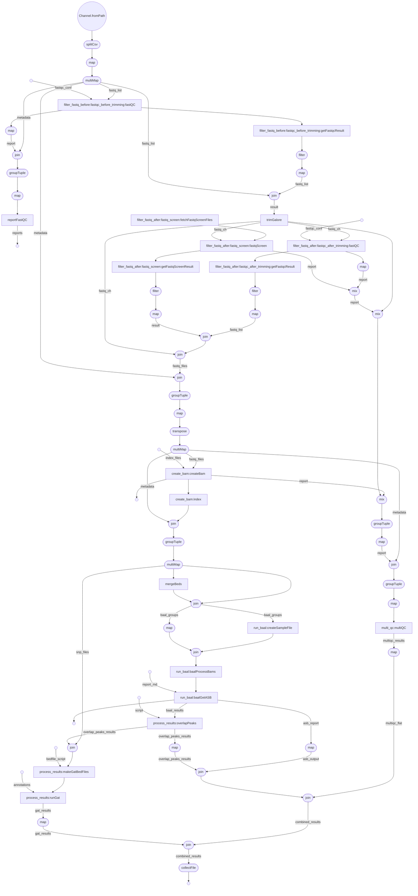

# Pipeline Design

# Stages

The pipeline consists of a number of stages. See the flowchart at the end of this document for a brief overview.

## QC

### Initial FastQC

Processes:
- `qc::fastQC`
- `qc::getFastqcResult`

This stage is a coarse filter, intended to throw out input that for whatever reason is unparseable or of so low quality that it's not fit for further processing. Most FastQC filters are disabled. The ones that are used are

- `quality_sequence`
- `tile`
- `sequence_length`

Full configuration can be found in [data/before_limits.txt](/data/before_limits.txt).

`getFastqcResult` is a simple bash script that will print FAIL to stdout if one or more filters have failed.
The `filter_fastq` workflow uses this to discard any fastq files that do not meet the threshold.

### TrimGalore

Can be found in `fastq::trimGalore`.
This runs `TrimGalore` on the fastq files, to perform best-guess adapter trimming.
No optional arguments are passed, but `TrimGalore` is called appropriately for single-stranded and double-stranded fastq files.

Trim galore produces a report, which is collated alongside other reports and provided to multiQC later.

### Fetching FastqScreen files

Process: `qc::fetchFastqScreenFiles`

This process stores the reference genomes required by `FastqScreen` in a configurable folder as designated by `fastq_screen_cache`.
This step is only run once per user.
If the folder already exists, this process will not run.

### FastQ-screen

Process: `qc::fastqScreen`

`FastqScreen` looks for sample contamination by randomly sampling reads and seeing if they match reference genomes from a wide variety of species.
It produces a report which is collated by MultiQC.

### Filtering based on FastqScreen results

Process: `qc::getFastqScreenResult`

This is a simple python script that looks through all non-human reference genomes in the FastQ-screen report.
If, for any genome, less than a configurable percentage (`max_acceptable_unmapped`) of the input reads are not mapped (i.e. if a large amount of the input reads are successfully mapped to this genome), the input file is discarded as likely contaminated. 

### FastQC

`FastQC` and filtering is done exactly as for [the initial fastqc filtering](#initial-fastqc), but with a different configuration file, namely [data/after_limits.txt](/data/after_limits.txt)

These are the same processes, the workflow is imported twice into [`main.nf`](/main.nf) as `filter_fastq_before` and `filter_fastq_after`.

## Mapping

### Bowtie2

Process: `fastq::createBam`
Maps using the `hg19` reference genome from igenomes by default.
Note that if you change the reference genome you will also need to modify the use of BaalChIP to use different blacklists when doing variant calling.

### picard

Process: `fastq::markDuplicates`
Marks duplicate reads.

## BaalChIP

### Create Config File

Process:`baal::createSampleFile`

### Filter Reads and Count Instance of Each Allele

Process: `baal::baalProcessBams`

### getASB

## Post-processing
- multiQC
- GAT

## Flowchart

